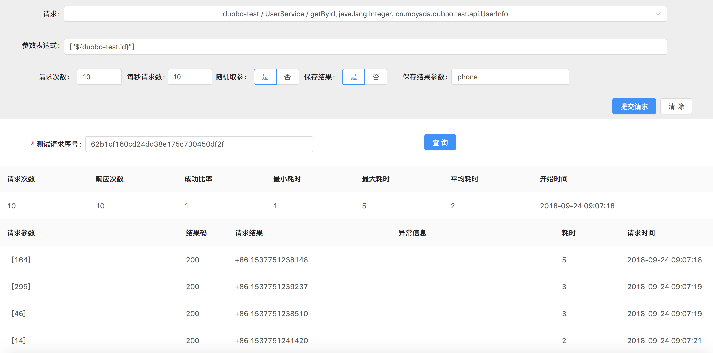

Sharingan
---------------

sharingan 是用来快速检测回归RPC服务 `可用性` 的 Java 工程。
在项目快速迭代时期，由于工期紧凑、逻辑复杂、测试覆盖范围不全等原因程序中往往可能存在疏忽的各种问题。
通过定义 `参数表达式` 对服务进行模拟调用，生成测试报告，检测程序中可能存在的各种异常。

### 文档 https://moyada.github.io/medivh/

## 预览

### 常量

### 领域表达式

### 数值表达式

### 对象表达式
