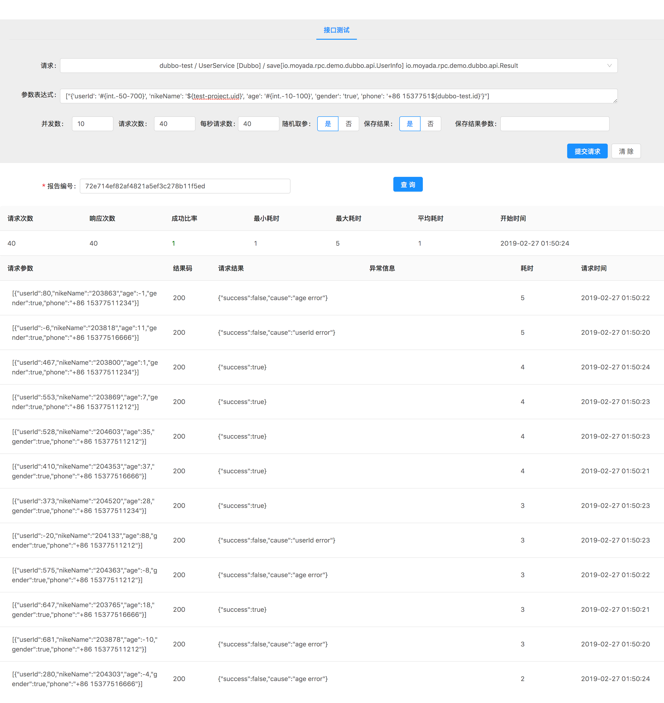

Sharingan
---------------

Sharingan 是一个模拟远程服务调用的项目，能够动态生成参数检测服务的可用性，从中发现并反馈异常问题。

目前支持的 RPC 框架有
[Dubbo](http://dubbo.apache.org/)、
[Spring Cloud](http://projects.spring.io/spring-cloud/)、
[SOFA](https://www.sofastack.tech/)、
~~gRPC~~。

### [使用文档](https://moyada.github.io/sharingan/)

## 预览

