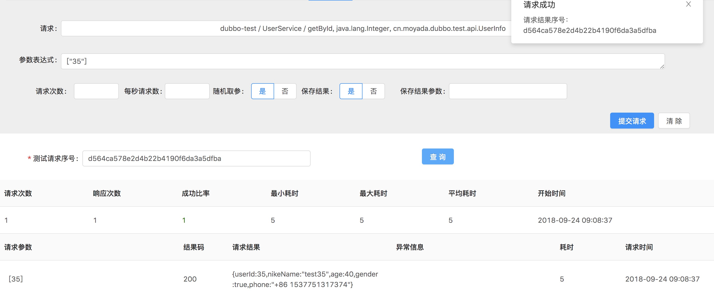
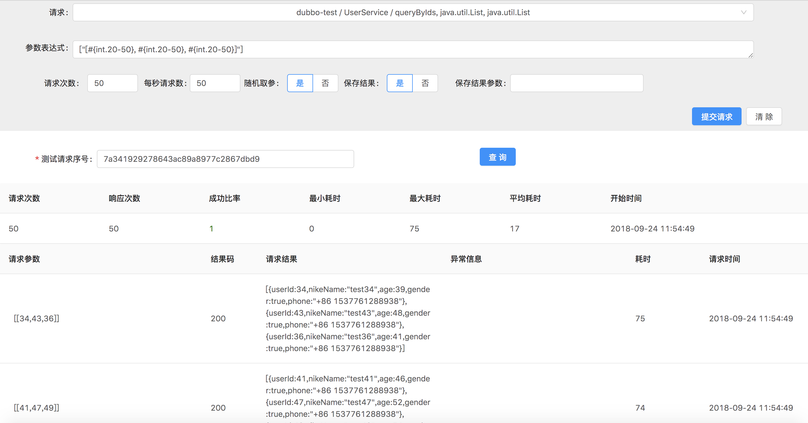

Sharingan
---------------

sharingan 是用来快速检测回归RPC服务 `可用性` 的Java工程。
在项目快速迭代时期，由于工期紧凑、逻辑复杂、测试覆盖范围不全等原因程序中往往可能存在疏忽的各种问题。
通过定义 `参数表达式` 对服务进行模拟调用，生成测试报告，检测程序中可能存在的各种异常。

## 功能特性

* [参数表达式](#参数表达式)，根据配置规则动态生成请求参数。
  例如，领域数据表达式: `${test.data}`、随机整数表达式: `#{int.random}`、范围浮点数表达式: `#{double[3].-50.5-300.8}`

* rpc协议支持，目前支持 [Dubbo](http://dubbo.apache.org/)、[Spring Cloud](http://projects.spring.io/spring-cloud/)。

* 监听服务调用，存储方法调用数据，用于测试生成请求参数。

## 如何使用

1. 要求 `jdk1.8` 以上版本，通过 [这里](https://github.com/moyada/sharingan/releases) 下载解压。

2. 初始化mysql数据库，执行 `schema` 文件下的 `info.sql` 和 `invoke.sql` 。

3. 修改 `conf.properties` 文件配置项目环境。

| 参数 | 描述 |
| --- | ---- |
| sharingan.datasource.url | mysql 连接地址 |
| sharingan.datasource.username | mysql 连接用户名 |
| sharingan.datasource.password | mysql 连接密码 |
| sharingan.maven.registry | nexus3 仓库地址(可选) |
| sharingan.maven.username | nexus3 仓库账号(可选) |
| sharingan.maven.username | nexus3 仓库密码(可选) |
| sharingan.rpc.dubbo.registry | dubbo 注册中心地址(可选) |
| sharingan.rpc.dubbo.username | dubbo 注册中心账号(可选) |
| sharingan.rpc.dubbo.password | dubbo 注册中心密码(可选) |
| sharingan.rpc.springcloud.registry | SpringCloud-eureka 注册地址(可选) |

4. 启动sharingan: `./run.sh`

5. 访问链接 `htto://127.0.0.1:8080/index.html` 进入管理界面。

> 测试数据位于 `schema/test.sql` 。

## 参数表达式

* 领域数据表达式: 表达式格式为 `${项目名称.数据领域}`，通过 `io.moyada.sharingan.domain.expression.DataRepository` 查询来指定规则动态生成请求参数，
  默认mysql实现中，项目名称为 `app_info` 表中的 `name` 、数据领域为 `invoke_param` 中的 `domain` 。

* 数值表达式: 默认带有整数和浮点数的生成表达式。
整数表达式: 可设置随机范围 `#{int.开始-结束}` ，或者无范围 `#{int.random}` 。
浮点数表达式: 可设置随机范围 `#{double[精度].开始-结束}` ，或者无范围 `#{double.random}` ，对于 `[精度]` 设置可选，缺省为 3。


### 常量


### 领域表达式


### 数值表达式


### 对象表达式


### 调用采集

要求项目使用 Spring-Boot (建议版本 2.x.x+)

1. 执行 `scripts/build-monitor.sh` 安装依赖。

2. 加入监视器依赖

```
<dependency>
    <groupId>io.moyada</groupId>
    <artifactId>sharingan-spring-boot-starter</artifactId>
</dependency>
```

3. 配置监视器参数

```
sharingan:
  monitor:
    enable: true
    application: test
    group_id: my.company
    artifact-id: test-service

    # 数据处理间隔时间
    interval-time: 3000
    # 批量上传数据大小
    threshold-size: 100
    
    # 配置上传调用数据
    type: mysql
    
    # 配置上传调用方法
    register: mysql
    
    # mysql 方式
    data-source:
      url: jdbc:mysql://127.0.0.1:3306/sharingan?useSSL=false&useUnicode=true&useAffectedRows=true&serverTimezone=Asia/Shanghai
      username: root
      password: root

```

4. 配置监控注解

| 注解 | 作用域 | 作用 |
| --- | ---- | ---- |
| [@Monitor](https://github.com/moyada/sharingan/blob/master/sharingan-spring/sharingan-spring-boot-autoconfigure/src/main/java/io/moyada/sharingan/spring/boot/autoconfigure/annotation/Monitor.java) | 类 | 配置监控并上传调用服务信息  |
| [@Listener](https://github.com/moyada/sharingan/blob/master/sharingan-spring/sharingan-spring-boot-autoconfigure/src/main/java/io/moyada/sharingan/spring/boot/autoconfigure/annotation/Listener.java) | 方法 | 监控方法调用 |
| [@Register](https://github.com/moyada/sharingan/blob/master/sharingan-spring/sharingan-spring-boot-autoconfigure/src/main/java/io/moyada/sharingan/spring/boot/autoconfigure/annotation/Register.java) | 方法 | 上传调用方法信息 |

例如: 

```
@Monitor(value = TestController.class, protocol = Protocol.SPRING_CLOUD)
@RestController
public class TestControllerImpl implements TestController {

    @Register
    @HttpMethod(param = {"key"})
    public String getInfo(@RequestParam("key") String key) {
        ...
    }

    @Listener(value = "id")
    @Register
    public Result getResultById(@PathVariable("id") Long id) {
        ...
    }
}
```