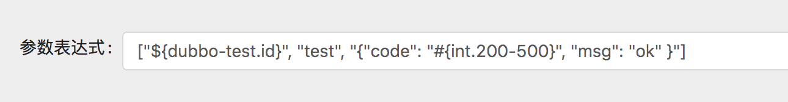
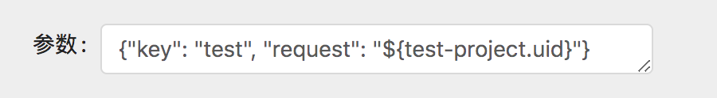

# 介绍

在日常开发迭代中，由于代码逻辑复杂、测试覆盖范围不全、疏忽大意等原因可能使得应用存在难以发现的故障，这将会降低系统的健壮性。

Sharingan 通过定义规则动态生成请求参数，模拟远程服务调用，检测服务的`可用性`，并生成测试报告反馈发现的异常。

目前支持的 RPC 框架有
[Dubbo](http://dubbo.apache.org/)、
[Spring Cloud](http://projects.spring.io/spring-cloud/)、
[SOFA](https://www.sofastack.tech/)、
~~gRPC~~。

# 如何使用

1. 要求 jdk 版本为 1.8，通过 [这里](https://github.com/moyada/sharingan/releases) 下载可执行项目解压。

2. 初始化 mysql 数据库，执行 `schema` 文件下的 `metadata.sql` 和 `invoke.sql` 。

 - 测试数据可参考 `schema/test.sql`。

3. 修改 `config.properties` 文件配置项目环境。

| 参数 | 描述 |
| --- | ---- |
| sharingan.datasource.url | mysql 连接地址 |
| sharingan.datasource.username | mysql 连接用户名 |
| sharingan.datasource.password | mysql 连接密码 |
| sharingan.maven.registry | nexus3 仓库地址 (作为 Dubbo、SOFA 协议的所需支持) |
| sharingan.maven.username | nexus3 仓库账号 |
| sharingan.maven.username | nexus3 仓库密码 |
| sharingan.rpc.dubbo.registry | dubbo 注册中心地址 |
| sharingan.rpc.dubbo.username | dubbo 注册中心账号 |
| sharingan.rpc.dubbo.password | dubbo 注册中心密码 |
| sharingan.rpc.springcloud.registry | SpringCloud-eureka 注册地址 |
| sharingan.rpc.sofa.registry | sofa 注册中心地址 |
| sharingan.rpc.sofa.direct-url | sofa 直连地址 |
| sharingan.rpc.sofa.protocol | sofa 调用协议，默认 bolt |

4. 启动sharingan: `./run.sh`，访问链接 `htto://127.0.0.1:8080/index.html` 进入管理界面，选择测试服务并将参数以 `json` 形式填入即可测试触发请求。

> **例如**  Dubbo、SOFA 等自定义协议方式的调用参数形式为 `["参数1", "参数2" ... ]` 
>
>
>
>SpringCloud 等 HTTP 方式的调用参数形式为 `{"参数名1": "参数", "参数名2": "参数" ... }`
>
>


## 参数表达式

参数表达式是一种动态生成参数的方式，它将会根据配置的规则动态生成请求参数。
  例如，通过资源生成的领域数据表达式: `${test.data}`、根据规则生成的整数表达式: `#{int.100-300}`, `#{int.random}`、浮点数表达式: `#{double[3].-50.5-300.8}`, `#{double.random}`。

### 领域表达式

表达式的格式为 `${项目名称.数据领域}`，将通过 `io.moyada.sharingan.domain.expression.DataRepository` 获取外部资源来生成请求参数。
  
默认mysql实现中，项目名称对应 `app_info` 表中的 `name`，数据领域对应 `invoke_data` 中的 `domain` ，最终从 `invoke_data` 中获取映射的数据。

### 数值表达式

默认带有整数和浮点数的生成表达式。

* 整数表达式: 可设置随机范围 `#{int.开始-结束}` ，或者无范围 `#{int.random}` 。

* 浮点数表达式: 可设置随机范围 `#{double[精度].开始-结束}` ，或者无范围 `#{double.random}` ，`[精度]` 设置为可选，缺省值 3。

# 监控调用数据

监听服务调用，将会自动将方法参数进行存储，作为测试参数资源。

## 1. 安装监视器依赖

执行 `scripts/build-monitor.sh` 安装依赖。

## 2. 加入监视器依赖

```
<dependency>
    <groupId>io.moyada</groupId>
    <artifactId>sharingan-spring-boot-starter</artifactId>
    <version>0.0.1-SNAPSHOT</version>
</dependency>
```

## 3. 配置监视器参数


| 参数 | 描述 |
| --- | ---- |
| sharingan.monitor.enable | 监控器开关，默认 true |
| sharingan.monitor.application | 应用名 |
| sharingan.monitor.group-id | 组织名 |
| sharingan.monitor.artifact-id | 项目标识 |
| sharingan.monitor.interval-time | 监控器处理间隔时间，默认 3000 毫秒 |
| sharingan.monitor.threshold-size | 监控器批量数据处理大小，默认 100 |
| sharingan.monitor.type | 监听方法参数方式，可选 mysql |
| sharingan.monitor.register | 服务信息上报方式，可选 mysql |
| sharingan.monitor.data-source.driver-class-name | mysql 方式连接驱动，默认为 com.mysql.cj.jdbc.Driver |
| sharingan.monitor.data-source.url | mysql 方式连接地址 |
| sharingan.monitor.data-source.username | mysql 方式连接用户名 |
| sharingan.monitor.data-source.password | mysql 方式连接密码 |

如

```
sharingan:
  monitor:
    application: test
    group-id: io.moyada
    artifact-id: test-dubbo-api
    
    # 配置上传调用数据
    type: mysql
    
    # 配置上传调用方法
    register: mysql
    
    # mysql 方式
    data-source:
      url: jdbc:mysql://127.0.0.1:3306/sharingan?useSSL=false&useUnicode=true&useAffectedRows=true&serverTimezone=Asia/
      username: root
      password: root

```

## 4. 配置监控注解

| 注解 | 作用域 | 作用 |
| --- | ---- | ---- |
| [@EnableSharinganMonitor](https://github.com/moyada/sharingan/blob/master/sharingan-spring-boot-starter/src/main/java/io/moyada/spring/boot/sharingan/annotation/EnableSharinganMonitor.java) | 类 | 启用监视器 |
| [@Monitor](https://github.com/moyada/sharingan/blob/master/sharingan-spring-boot-starter/src/main/java/io/moyada/spring/boot/sharingan/annotation/Monitor.java) | 类 | 配置监控并上传调用服务信息  |
| [@Listener](https://github.com/moyada/sharingan/blob/master/sharingan-spring-boot-starter/src/main/java/io/moyada/spring/boot/sharingan/annotation/Listener.java) | 方法 | 监控方法调用 |
| [@Register](https://github.com/moyada/sharingan/blob/master/sharingan-spring-boot-starter/src/main/java/io/moyada/spring/boot/sharingan/annotation/Register.java) | 方法 | 上传调用方法信息 |
| [@HttpMethod](https://github.com/moyada/sharingan/blob/master/sharingan-spring-boot-starter/src/main/java/io/moyada/spring/boot/sharingan/annotation/HttpMethod.java) | 方法 | 将上传的方法信息替换为 http 信息 |

将 `@EnableSharinganMonitor` 设置在配置类，并为目标的对象设置注解，目标类需要被 Spring 容器管理。

例如: https://github.com/moyada/sharingan/blob/master/sharingan-spring-boot-starter/src/main/java/io/moyada/spring/boot/sharingan/test/

